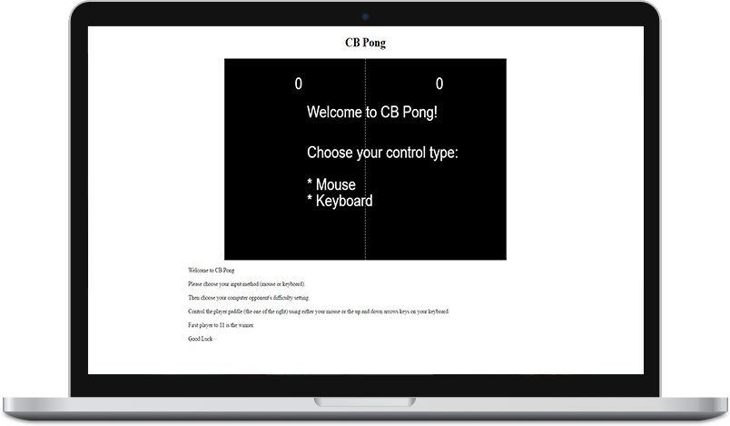

# CB Pong: Replica of the First Computer Game, [Pong](http://www.ponggame.org/)

CB Pong is a Pong replica written entirely inside of the HTML5 **Canvas** element.

TODO:
  * Improve the rebound physics, including spin, around the edges of the paddles.
  * Further fine tune the speed of the ball and of the paddles.
  * Further fine tune the difficulty levels of the computer player.
  * Adjust the collision detection to become more robust to predict where the ball will be and thus avoid potentially clipping through the paddle.

[Play the game.](https://caseybennington.github.io/cb-pong)
